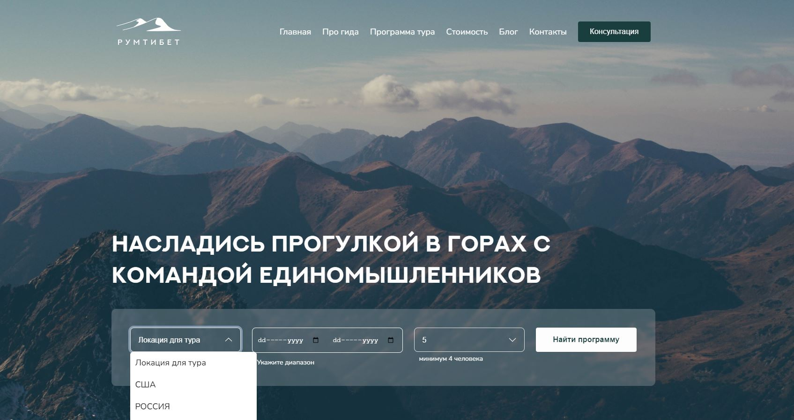
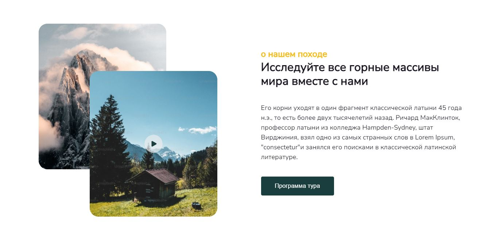
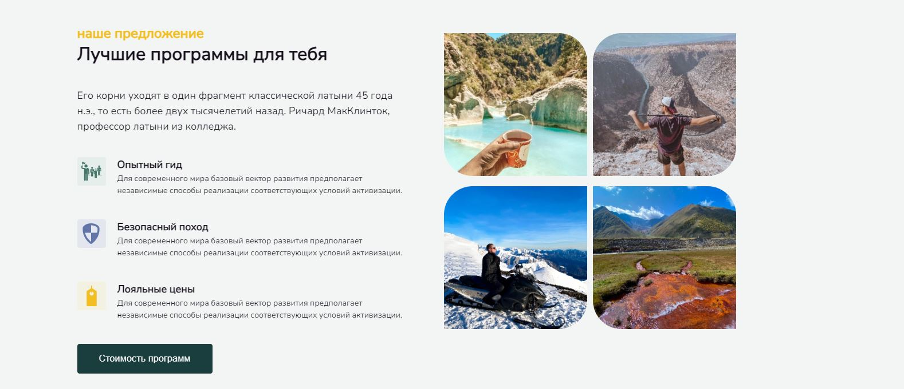
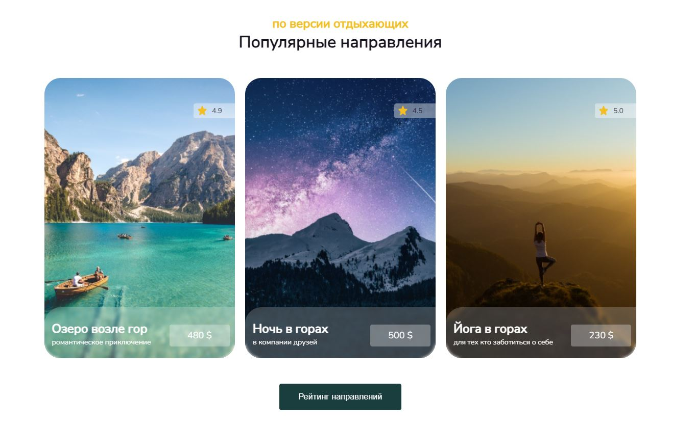
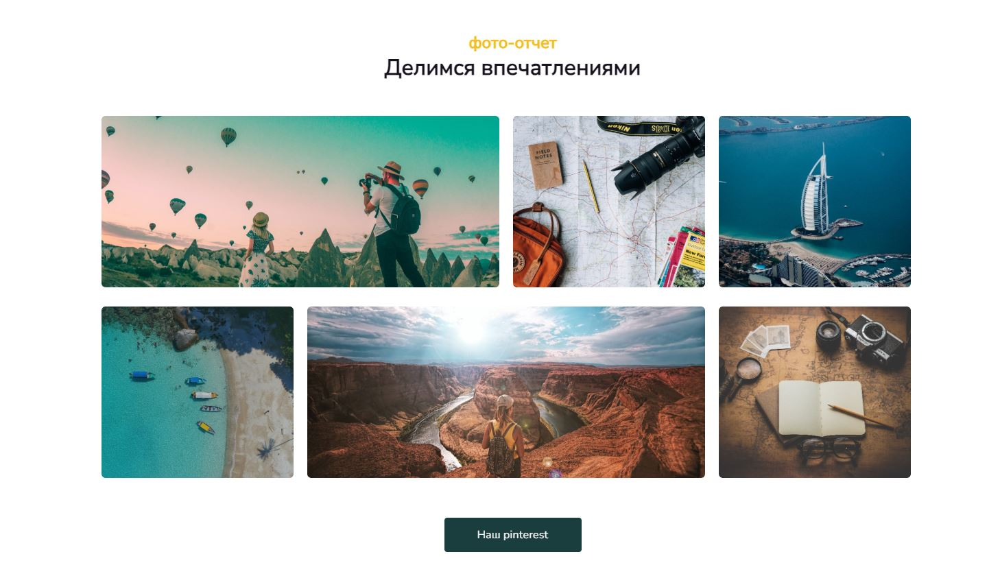
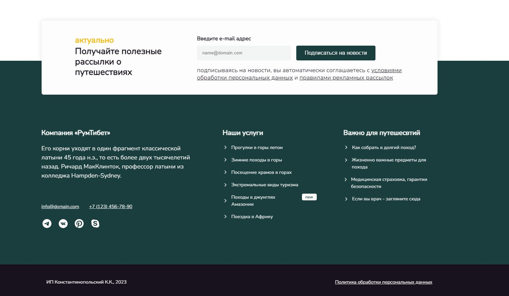

# Traveling in Tibet

 
   
    
  

 <a href="https://sergeylif.github.io/projectCyberPank/">Preview</a> &nbsp;&nbsp;&nbsp;|&nbsp;&nbsp;
  <a href="https://www.figma.com/file/NrPZZU8u1sLytOicIHcIAx/%D0%A0%D1%83%D0%BC%D0%A2%D0%B8%D0%B1%D0%B5%D1%82?type=design&node-id=0-1&mode=design">Original design</a>&nbsp;&nbsp;&nbsp;|&nbsp;
   &nbsp;

